# TextMate

## Download

Install this fork via Homebrew:

```sh
brew install --cask tectiv3/textmate/textmate
```

Or download a signed and notarized build from the [releases page](https://github.com/tectiv3/textmate/releases).

The official (upstream) TextMate is available [from macromates.com](https://macromates.com/download).

## Feedback

Use [GitHub Issues](https://github.com/tectiv3/textmate/issues) for bug reports and feature requests.

## Screenshot


## Screenshots

### Command Palette

<p align="center">
  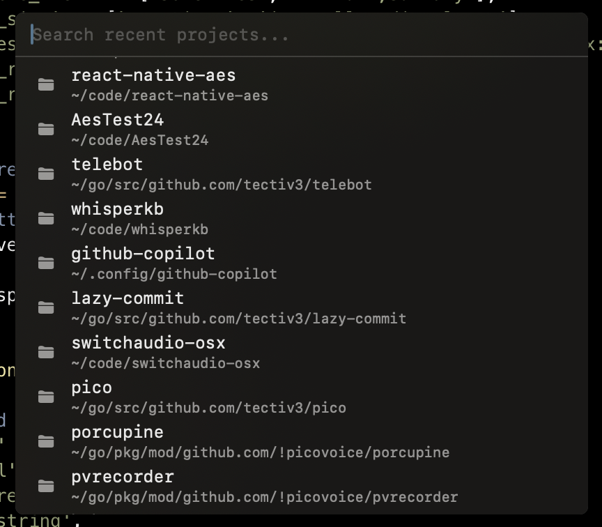
  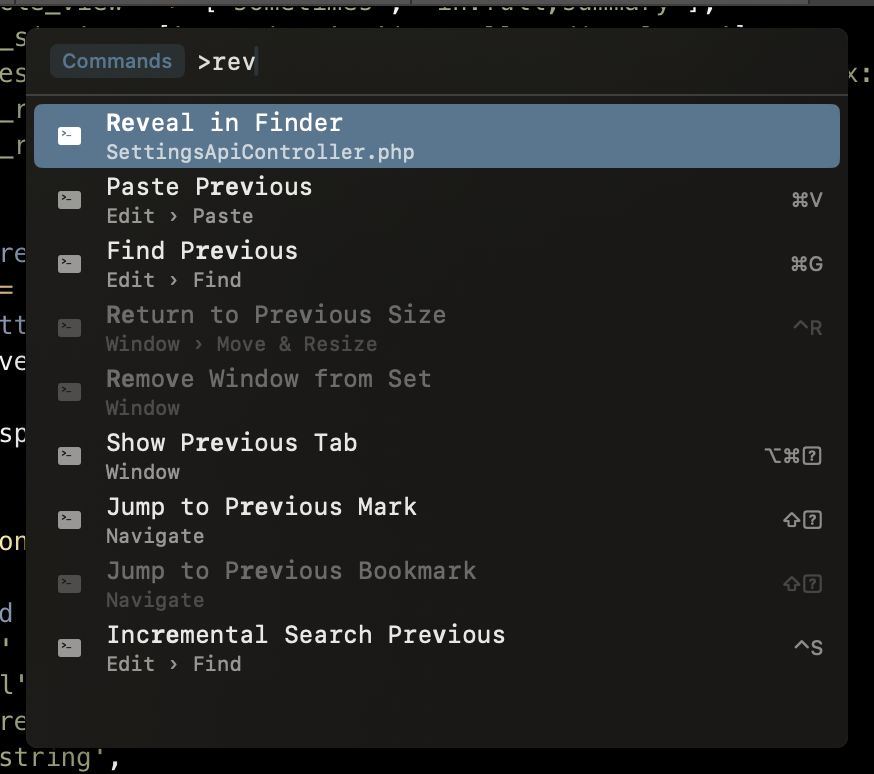
</p>
<p align="center">
  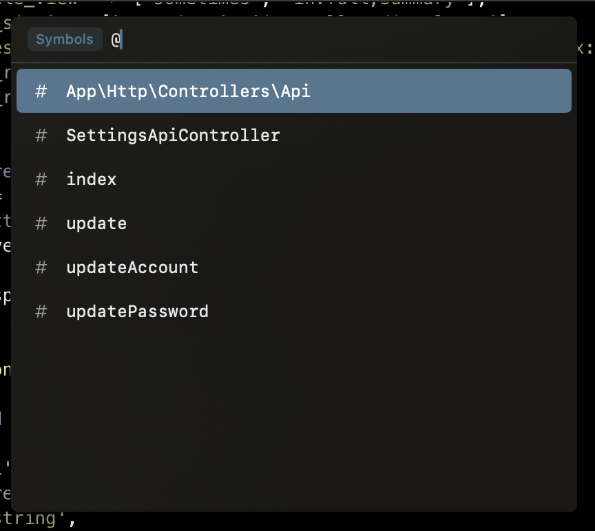
  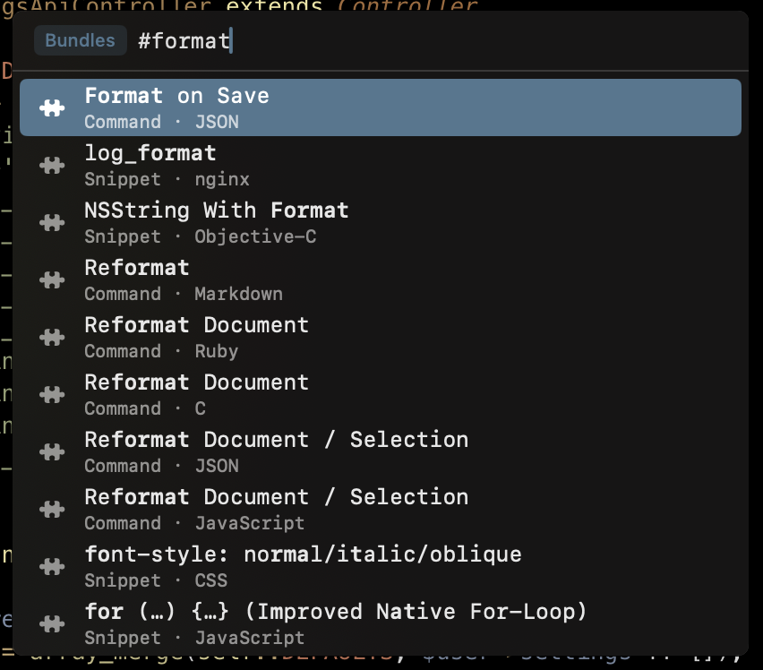
</p>
<p align="center">
  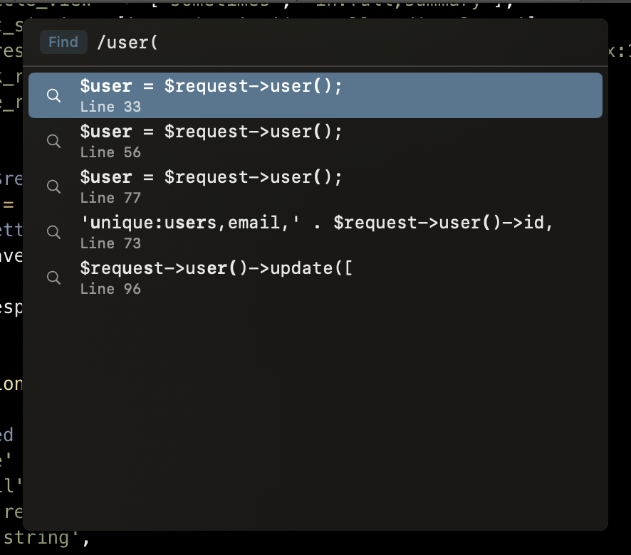
  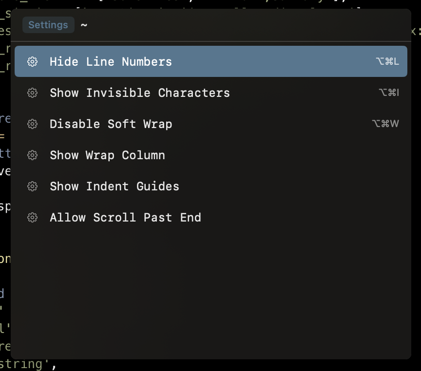
</p>

### LSP

<p align="center">
  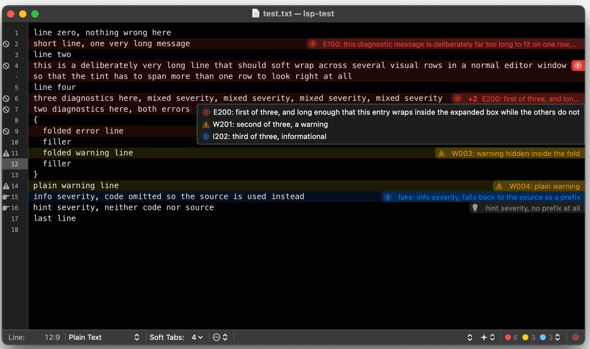
</p>
<p align="center">
  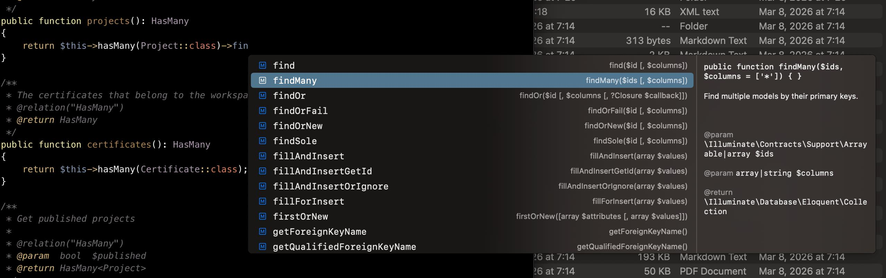
</p>
<p align="center">
  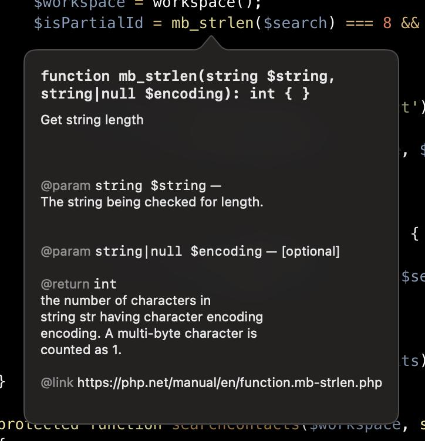
  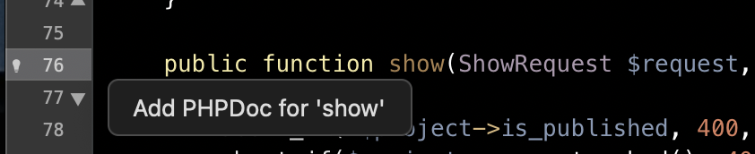
</p>
<p align="center">
  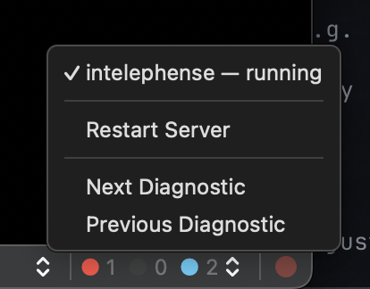
</p>

### Copilot

<p align="center">
  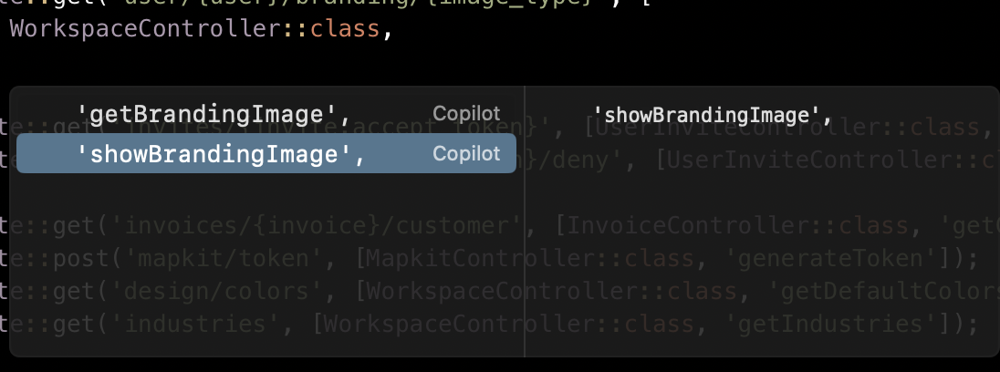
</p>
<p align="center">
  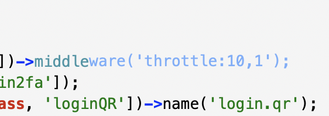
  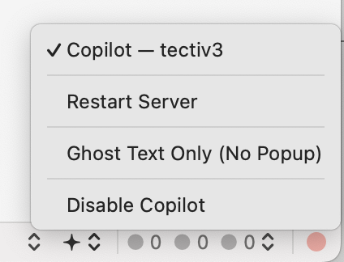
</p>

# Building

## Requirements

 * macOS 14.0 (Sonoma) or later
 * Xcode (full install, not just Command Line Tools — `ibtool` and `actool` are required).
   Make sure the active developer directory points to Xcode: `sudo xcode-select -s /Applications/Xcode.app/Contents/Developer`
 * [ninja][]            — build system similar to `make`
 * [cmake][] ≥ 3.21     — meta build system

All dependencies can be installed using [Homebrew][]:

```sh
brew install ninja cmake
```

## Setup

```sh
git clone --recursive https://github.com/tectiv3/textmate.git
cd textmate
make run
```

If you already cloned without `--recursive`, fetch the submodules separately:

```sh
git submodule update --init --recursive
```

## Build Commands

```sh
make debug           # Incremental debug build (ASan enabled)
make release         # Incremental release build (LTO, no ASan)
make run             # Build debug and launch
make clean           # Remove all build dirs
```

## Dependencies Removed

| Dependency | Status | Replacement |
|-----------|--------|-------------|
| Old rave build system (62 files) | Removed | CMake + Ninja |
| multimarkdown + bin/gen_html | Removed | Pre-converted HTML |
| Cap'n Proto | Replaced | NSKeyedArchiver |
| google-sparsehash | Replaced | `std::unordered_map` |
| ragel | Replaced | Hand-written parser |
| boost (variant + crc) | Replaced | `std::variant` + zlib `crc32` |

## Command Palette

Press **Cmd+Shift+P** to open the command palette — a unified fuzzy-search interface for navigating TextMate. Type a prefix to switch modes:

| Prefix | Mode | What it does |
|--------|------|-------------|
| (none) | Recent Projects | Open a recent project |
| `>` | Commands | Run any menu action or bundle command |
| `@` | Symbols | Jump to a symbol in the current document |
| `#` | Bundle Editor | Open a grammar, snippet, or command in the bundle editor |
| `:` | Go to Line | Jump to a line number |
| `/` | Find in Project | Open Find in Project with a pre-filled query |
| `~` | Settings | Toggle editor settings (soft wrap, invisibles, etc.) |

Results are ranked by fuzzy match score. Frequently used items are boosted over time.

## LSP Support

TextMate has built-in Language Server Protocol support for diagnostics and completions. Configure it per-project in `.tm_properties`:

### PHP (intelephense)

```
# .tm_properties
[ *.php ]
lspCommand = "intelephense --stdio"
lspInitOptions = '{"licenceKey":"YOUR-KEY-HERE","clearCache":true}'
```

### Go (gopls)

```
# .tm_properties
[ *.go ]
lspCommand = gopls
```

### C/C++/Objective-C (clangd)

```
# .tm_properties
[ *.{c,cc,cpp,h,hpp,m,mm} ]
lspCommand = clangd
```

### Python (pyright)

```
# .tm_properties
[ *.py ]
lspCommand = "pyright-langserver --stdio"
```

### Python (pylsp)

Alternative Python server with plugin ecosystem (ruff, mypy, black):

```
# .tm_properties
[ *.py ]
lspCommand = pylsp
```

To disable specific plugins (e.g. mypy if it can't find your project's dependencies):

```
# .tm_properties
[ *.py ]
lspCommand = pylsp
lspInitOptions = '{"pylsp": {"plugins": {"pylsp_mypy": {"enabled": false}}}}'
```

If you need pylsp to resolve project-specific packages, install it inside your project's virtualenv instead of using the global one.

### Vue/TypeScript (Volar 2.x)

Volar 2.0+ uses Hybrid Mode with `typescript-language-server` for script support:

```
# .tm_properties
[ *.{vue,ts,tsx,js,jsx} ]
lspCommand = "$TM_PROJECT_DIRECTORY/node_modules/.bin/typescript-language-server --stdio"
lspInitOptions = '{ "plugins": [{ "name": "@vue/typescript-plugin", "location": "./node_modules/@vue/language-server", "languages": ["vue"] }] }'
```

### Rust (rust-analyzer)

```
# .tm_properties
[ *.rs ]
lspCommand = rust-analyzer
```

### Lua (lua-language-server)

```
# .tm_properties
[ *.lua ]
lspCommand = lua-language-server
```

### Bash (bash-language-server)

```
# .tm_properties
[ *.{sh,bash,zsh} ]
lspCommand = "bash-language-server start"
```

### Ruby (ruby-lsp)

```
# .tm_properties
[ *.rb ]
lspCommand = ruby-lsp
```

### Swift (sourcekit-lsp)

Requires Xcode. Project must have a `Package.swift` or `compile_commands.json`.

```
# .tm_properties
[ *.swift ]
lspCommand = "xcrun sourcekit-lsp"
```

### Settings

| Property | Description |
|----------|-------------|
| `lspCommand` | Command to launch the language server (required) |
| `lspEnabled` | Set to `false` to disable LSP for matching files (default: `true`) |
| `lspRootPath` | Override workspace root detection |
| `lspInitOptions` | JSON object passed as `initializationOptions` to the server |
| `lspFormatOnSave` | Set to `true` to format via LSP before saving (default: `false`) |
| `formatCommand` | Shell command for an external formatter (stdin/stdout, overrides LSP formatting) |
| `formatOnSave` | Set to `true` to format before saving — uses `formatCommand` if set, else LSP (default: `false`) |

Press **Opt+Tab** to trigger LSP completions. Diagnostics (errors, warnings) appear automatically in the gutter.

### Debugging

Open the LSP log panel via **View → LSP Log** (or click the LSP status indicator in the bottom bar). Shows all JSON-RPC traffic, server stderr, errors, and lifecycle events. Use the filter field to narrow by server name or message content.

## GitHub Copilot

TextMate supports GitHub Copilot inline completions (ghost text). Requires a GitHub Copilot subscription.
Copilot is disabled by default.

### Installation

Install `copilot-language-server` (the modern native binary):

```sh
npm install -g @github/copilot-language-server
```

Or via nix:

```nix
environment.systemPackages = [ pkgs.copilot-language-server ];
```

Enable Copilot from the status bar menu, or set `copilotEnabled = true` in `.tm_properties`.
When enabled, TextMate auto-detects the binary from `$PATH`. To override, set `copilotCommand`:

```
copilotEnabled = true
copilotCommand = /path/to/copilot-language-server
```

### Settings

| Property | Description |
|----------|-------------|
| `copilotCommand` | Path to copilot-language-server binary (overrides auto-detect) |
| `copilotEnabled` | Set to `true` to enable Copilot for matching files (default: `false`) |

### Usage

When enabled and signed in, Copilot suggestions appear automatically as ghost text while typing. Press **Tab** to accept, **Esc** to dismiss.

### Enabling

Set `copilotEnabled = true` in `.tm_properties`. Like all TextMate settings, it can be scoped globally, per-project, or per-file-type:

```
# ~/.tm_properties — enable everywhere
copilotEnabled = true

# project .tm_properties — enable for one file type
[ *.md ]
copilotEnabled = true
```

### Formatting

Format the current document via **Text → Format Code**. Enable format-on-save per file type.

#### Custom Formatter

You can use any external formatter that reads stdin and writes formatted output to stdout. When `formatCommand` is set, it takes priority over LSP formatting for that file type. Standard TextMate variables (`TM_FILEPATH`, `TM_TAB_SIZE`, `TM_SOFT_TABS`, etc.) are available to the command. The working directory is set to the project root so tools find their config files.

**Note:** Quote the command if it contains arguments.

```
# .tm_properties

# JavaScript/TypeScript with Prettier
[ *.{js,jsx,ts,tsx} ]
formatCommand = "prettier --parser=typescript"
formatOnSave  = true

# PHP with Prettier
[ *.php ]
formatCommand = "prettier --parser=php"
formatOnSave  = true

# Python with Black
[ *.py ]
formatCommand = "black -q -"
formatOnSave  = true

# Rust with rustfmt
[ *.rs ]
formatCommand = rustfmt
formatOnSave  = true

# Go with gofmt
[ *.go ]
formatCommand = gofmt
formatOnSave  = true

# C/C++/ObjC with clang-format
[ *.{c,cc,cpp,h,hpp,m,mm} ]
formatCommand = clang-format
formatOnSave  = true
```

#### LSP Formatting

For file types without a `formatCommand`, formatting falls back to the language server (if it supports `textDocument/formatting`):

```
# .tm_properties
[ *.php ]
formatOnSave = true
```

The legacy `lspFormatOnSave` key still works for backward compatibility.

# Legal

The source for TextMate is released under the GNU General Public License as published by the Free Software Foundation, either version 3 of the License, or (at your option) any later version.

TextMate is a trademark of Allan Odgaard.

[ninja]:         https://ninja-build.org/
[cmake]:         https://cmake.org/
[Homebrew]:      https://brew.sh/
